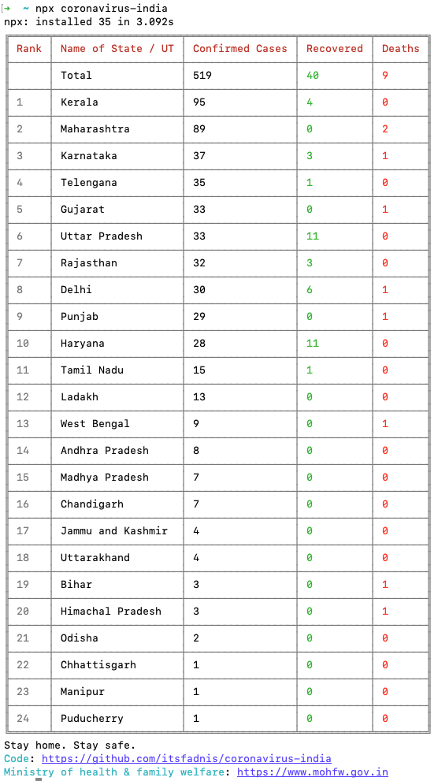

<h1 align="center">Welcome to coronavirus-india 👋</h1>
<p>
  <a href='https://semaphoreci.com/itsfadnis/coronavirus-india'>
    
  </a>
  
  
  <a href="https://github.com/itsfadnis/coronavirus-india/graphs/commit-activity" target="_blank">
    
  </a>
  <a href="https://twitter.com/itsfadnis" target="_blank">
    
  </a>
</p>

> Track official coronavirus numbers for India from the command line, published by the [Ministry of Health & Family Welfare](https://www.mohfw.gov.in)

## 📸 Screenshot


## Prerequisites

- node >=10.x

## 🚀 Usage

- With npx:

```sh
$ npx coronavirus-india
```

- With global installation:

```sh
$ npm i -g coronavirus-india
$ coronavirus-india
```

## Author

👤 **Nikhil Fadnis <nik.fadnis@gmail.com>**

* Twitter: [@itsfadnis](https://twitter.com/itsfadnis)
* Github: [@itsfadnis](https://github.com/itsfadnis)

## 🤝 Contributing

Contributions, issues and feature requests are welcome!<br />Feel free to check [issues page](https://github.com/itsfadnis/coronavirus-india/issues).

## Show your support

Give a ⭐️ if this project helped you!

## 📝 License

Copyright © 2020 [Nikhil Fadnis](https://github.com/itsfadnis).<br />
This project is [MIT](https://github.com/itsfadnis/coronavirus-india/blob/master/LICENSE) licensed.

***
_This README was generated with ❤️ by [readme-md-generator](https://github.com/kefranabg/readme-md-generator)_
